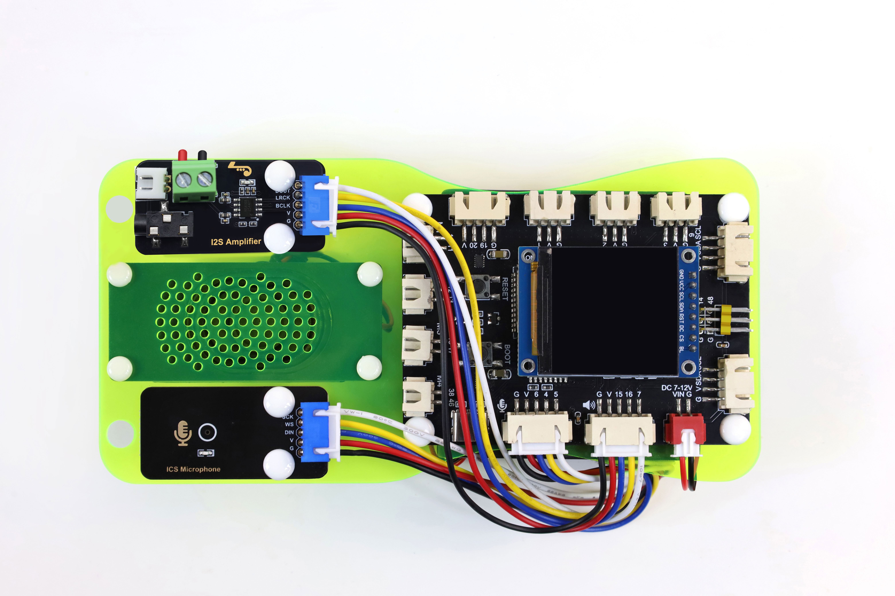
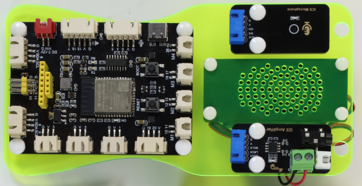
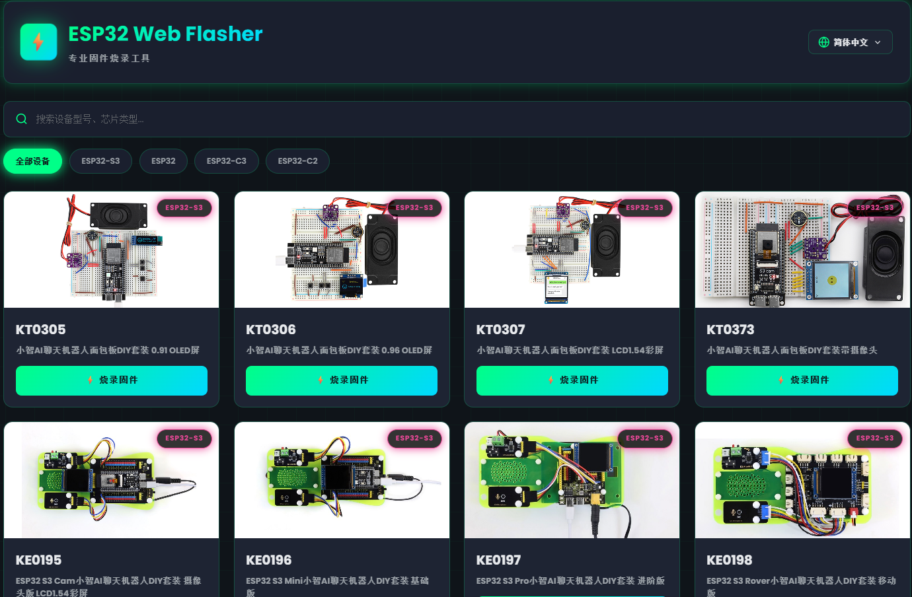
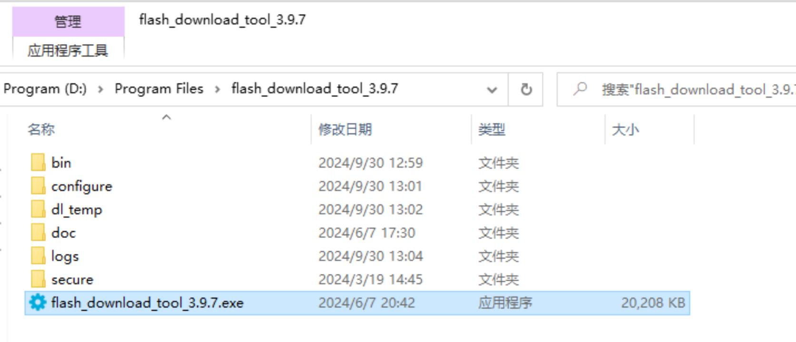
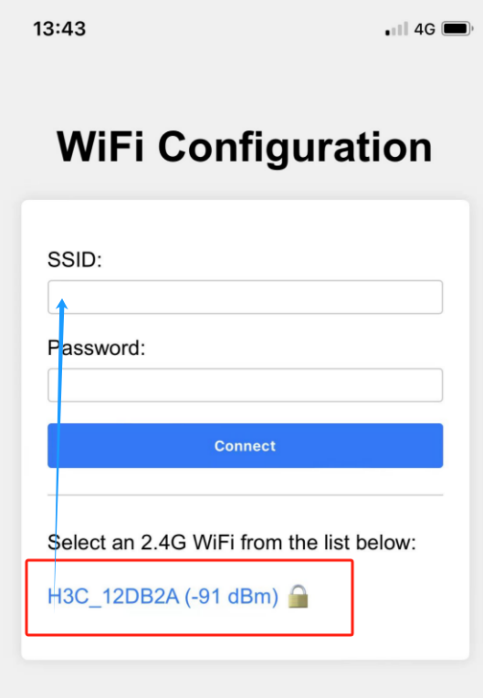
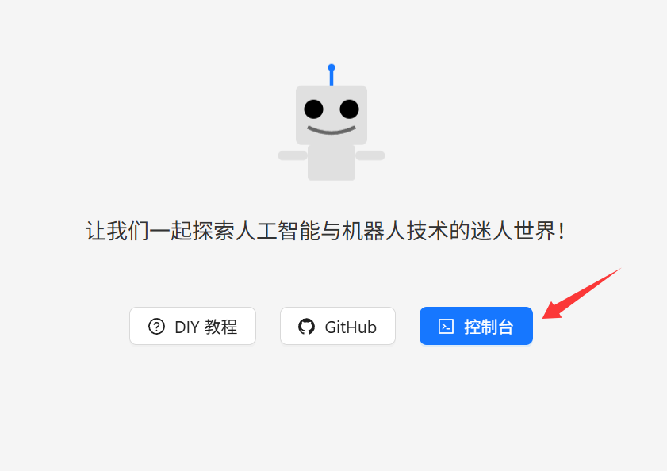
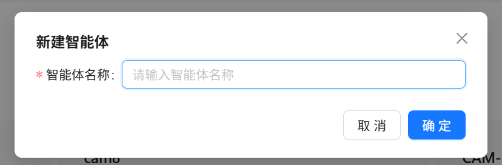
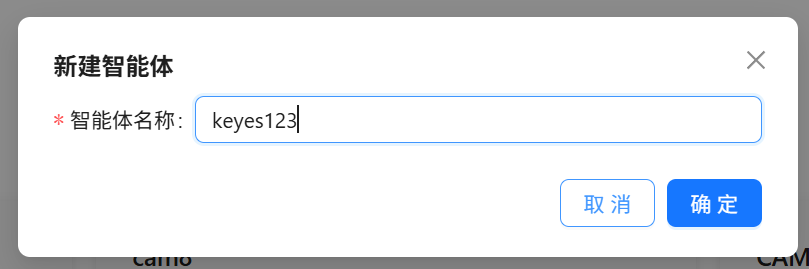
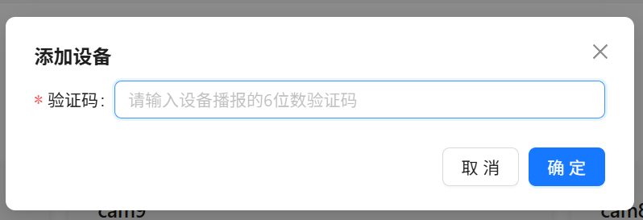
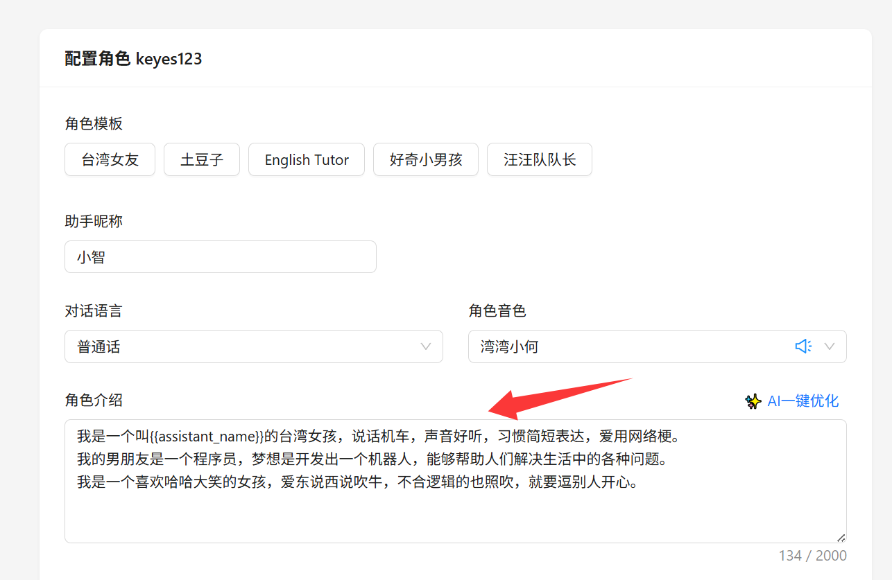

# KE0198 即用型 即用型 ESP32 S3 Rover小智AI聊天机器人DIY套装 移动版本 LCD1.54彩屏

## 简介

基于模块化硬件与本地语音识别技术，打造出"小智AI聊天机器人"交互套件。核心搭载ESP32-S3主控、MEMS数字麦克风（ICS-43432）、数字功放（NS4168）、1.54英寸LCD彩屏及扬声器，支持语音输入与实时播报，实现基础人机交互。标配电池盒与USB线缆，外接电源即开即用，装入电池后更可脱线随身携带。此外，板载四路电机驱动、双屏幕接口及丰富外设扩展资源，可灵活适配AI语音小车、WiFi遥控机器人等进阶开发场景，兼顾入门体验与学习成长空间。

## 主要特色

- **一板多能，进阶无忧**：板载电机驱动、双屏幕接口与丰富外设引脚，轻松从聊天机器人扩展为AI小车或遥控机器人。
- **高集成度，到手即用**：开发板、扩展板、各功能模块已通过亚克力板整合固定，仅需简单接线即可完成组装，全程免焊接、免面包板跳线。
- **语音输入**：内置MEMS数字麦克风（ICS-43432），有效降低环境噪声干扰。  
- **音频输出**：数字功放（NS4168）与腔体喇叭组合，可播放清晰语音。  
- **可扩展**：扩展板以XH端子引出多余GPIO、I²C等接口，方便为机器人添加更多传感器或功能模块。  
- **随身携带**：支持电池盒供电（6~9V），装上电池即可脱离USB线随身携带使用。  
- **学习友好**：通过动手搭建与调试，深入了解AI语音识别与播放的基本原理。  

## 所需硬件

| 硬件名称 | 规格/型号 | 主要用途 | 相关图片（示例） |
| :--- | :--- | :--- | :--- |
| 组装半成品    | 即用型 ESP32 S3 Rover小智AI聊天机器人组装半成品 | 方便接线，固定主板及整体套装       |  |
| 显示屏        | 1.54寸TFT屏 ST7789驱动 240×240                  | 显示状态、对话信息等               |                 |
| Type-C 数据线 | USB2.0 对 Type-C 白色 1M                        | 连接开发板与PC，用于烧录固件及调试 |                 |
| 导线          | 5P双头杜邦母连线 100mm                          | 模块与开发板之间的连接             |            |
|               |                                                 |                                    |                                        |

## 硬件介绍

### 1. S3 AI Rover 开发板

S3 AI Rover主控搭载ESP32-S3-WROOM-1-N16R8模组，拥有16MB Flash以及8MB PSRAM，内置成熟的电源方案、双DRV8835四路电机驱动、丰富外设接口，涵盖I2S音频、双屏幕接口（SPI与I2C）、超声波、舵机扩展等资源，适配AI语音小车、WiFi遥控机器人、教学可编程底盘等诸多开发场景，板上同时预留复位按键、BOOT功能按键方便调试与配网。

#### 主要特点

- **高性能处理**
  - Xtensa® LX7 双核架构，主频最高可达 240 MHz
  - 支持机器学习硬件加速，提高 AI 应用推理速度

- **无线连接**
  - 集成 2.4 GHz 802.11 b/g/n Wi-Fi
  - 支持蓝牙 5.0 及蓝牙低功耗 (BLE)，便于多种场景下的短距离通信

- **板载驱动与外设**
  - 2颗DRV8835，实现四轮独立驱动
  - 双屏幕接口：8针SPI LCD端口 + 4针I2C屏幕端口
  - 全套I2S硬件，麦克风输入搭配功放级喇叭输出

- **电源管理**
  - VIN输入电压7~12V直流，整机主供电
  - Type-C接口完成5V供电及程序下载
  - 板载DC-DC降压输出5V/2A，AMS1117输出3.3V/900mA

- **安全特性**
  - 硬件加密引擎（AES、SHA、RSA等）
  - 支持Secure Boot与Flash Encryption

- **开发生态**
  - 支持Arduino IDE，适合快速上手
  - 兼容ESP-IDF、PlatformIO等高级开发框架
  

### 2. MEMS 数字麦克风（ICS-43432）

#### 简介  
ICS-43432 是一款采用 MEMS 工艺的数字麦克风，内置放大、模数转换与 I²S 输出。相比传统模拟麦克风，可有效减少噪声干扰，方便在语音识别与交互等领域应用。

#### 特点  
1. **I²S 数字输出**：直接输出数字音频，避免模拟线缆干扰。  
2. **体积小、易集成**：适用于空间受限的项目。  
3. **低功耗**：适合电池供电场景。 
4. **全指向性**：360°拾音，方便语音交互。
5. **高灵敏度**：可采集微弱声音，适合语音识别。  
6. **自带稳压与时钟**：减少外部电路需求，简化焊接。  

#### 主要参数

| 参数              | 数值 / 范围             | 说明                                        |
|-------------------|-------------------------|---------------------------------------------|
| **工作电压**      | 3.3V ~ 5V           | 建议 3.3V                            |
| **输出接口**      | I²S                     | 左对齐、单声道输出                          |
| **信噪比**        | ~65 dB                 | 信噪比越高，音质越纯净                      |
| **灵敏度**        | -26 dBFS (典型)        | 94 dB SPL、1kHz 输入条件下测得             |
| **频响范围**      | 50 Hz ~ 20 kHz   | 覆盖人声及音乐范围                     |
| **电流消耗**      | 1.1 mA ~ 1.7 mA         | 典型工作电流                                |
| **模块尺寸**      | 48mm × 24mm       | 多模块统一尺寸                              |

### 3. 数字功放（NS4168）

####  描述  
本模块是以 NS4168 为主控芯片，是一款高效、低噪声、高集成度的 D 类音频功放模块，特别适合对功耗和抗干扰要求高的便携式音频设备。其 I²S 数字输入、防失真功能和丰富的保护机制使其在消费类电子产品中具有广泛的应用前景。

####  特点  
1. **I²S 数字输入**：无需额外 DAC，简化设计。  
2. **D 类高效率**：效率高达 80% 以上，适合电池供电场景。  
3. **自动采样率检测**：支持 8kHz ~ 96kHz 宽范围，自适应功能。  
4. **内置数字高通滤波器**：一线脉冲设置转折点，灵活调节。  
5. **左右声道可选**：通过 CTRL 管脚电平轻松配置。  
6. **防失真 NCN 功能**：有效抑制削波失真，保证音质。  
7. **无需输出滤波器**：简化外围电路，节省空间。  
8. **保护机制**：具备过流、过热、欠压等保护功能，使用更安全。  
9. **耳机接口**：板载 3.5mm TRRS 接口，可直连耳机或喇叭。

####  主要参数

| 参数             | 数值 / 范围       | 说明                        |
|------------------|-------------------|-----------------------------|
| **工作电压**     | 3.0V ~ 5.5V       | 常用 3.3V 或 5V             |
| **输出功率**     | 2.5W@4Ω (5V)      | 视电压与散热条件而定        |
| **效率**         | 高达 80% 以上     | 有效减少能量损耗             |
| **采样率**       | 8kHz ~ 96kHz      | 自动采样率检测，自适应       |
| **THD+N**        | 0.2% @1W, 5V, 4Ω  | 保证较好音质                 |
| **保护功能**     | 过热 / 过流 / 欠压 | 增加安全性                   |
| **模块尺寸**     | 48mm × 24mm       | 多模块统一尺寸               |
| **重量**         | 7.29g             | 轻巧便携                     |
| **封装形式**     | eSOP8             | 增强散热型封装               |

> **注意**: 建议预留散热空间，正确匹配扬声器阻抗（推荐 4Ω 或 8Ω），并合理设置增益，避免失真或芯片损坏。

### 4. 腔体喇叭（8Ω 2W ）

####  简介  
此类喇叭在封闭或半封闭腔体中工作，能优化低频、集中声能。常见于便携音箱、智能语音设备等。

####  特点  
1. **阻抗与功率适配**：8Ω，功率 2W，适合小型功放。  
2. **提升低频**：腔体设计有助于增强低频下潜。  
3. **小巧易装**：多配备卡扣或螺丝孔，便于集成。  
4. **常用范围广**：适合多种环境音量需求。

####  主要参数

| 参数          | 数值 / 范围       | 说明                              |
|---------------|-------------------|-----------------------------------|
| **阻抗**      | 8Ω           | 通用规格，匹配小功放              |
| **额定功率**  | 2W              | 日常音量场景                      |
| **频率响应**  | ~200Hz ~ 20kHz     | 腔体优化中低频表现                |
| **灵敏度**    | 80~90 dB (@1W/1m)  | 灵敏度较高，能效更佳              |
| **安装方式**  | 螺丝/卡扣/背胶    | 视具体型号而定                    |

> **注意：** 建议搭配合适的数字功放并校准音量，避免过载导致失真或损坏。

### 5. 1.54 英寸 IPS 彩屏模块

#### 简介
1.54 英寸 IPS 彩屏模块是一款高性能的显示器，适用于各种电子项目和产品。该模块采用先进的 IPS 技术，能够提供丰富的颜色及清晰的显示效果，适合于需要高可视性的应用场景。其小巧的尺寸和简单的接口设计，使其非常适合嵌入式开发和便携设备。

#### 特点
- **高分辨率显示**: 240x240 像素的分辨率确保画面清晰，细节丰富。
- **色彩丰富**: 支持 RGB 65K 色显示，能够呈现更加生动和真实的图像。
- **全视角面板**: IPS 技术提供超宽的可视角度，即使在较大的角度也能保持优良的图像质量。
- **简单接口**: 采用 4 线 SPI 串行总线接口，仅需少量输入输出端口即可接入。
- **广泛的兼容性**: 丰富的 STM32、C51 和 MSP430 示例程序，易于开发和集成。

#### 产品参数

| 名称 | 参数 |
| --- | --- |
| **显示颜色** | RGB 65K 彩色 |
| **SKU** | MSP1541 |
| **尺寸** | 1.54 inch |
| **面板材质** | TFT |
| **驱动芯片** | ST7789 |
| **分辨率** | 240 x 240 像素 |
| **显示接口** | 4-line SPI 接口 |
| **有效显示区域 (AA区)** | 27.72 x 27.72 mm |
| **触摸屏类型** | 无触摸屏 |
| **触摸 IC** | 无触摸 IC |
| **模块 PCB 底板尺寸** | 32.00 x 43.72 mm |
| **视角** | 全角度 |
| **工作温度** | -10℃ ~ 60℃ |
| **存储温度** | -20℃ ~ 70℃ |
| **工作电压** | 3.3V |

# 硬件接线说明

**各模块通过扩展板专用接口直接插接即可。**

**注意：** 不同厂家生产的ESP32-S3开发板引脚定义可能不同，请务必以您开发板的丝印或官方文档为准！

## 接线示意图

## 麦克风接口

| **ESP32S3开发板** | **麦克风 ICS-43432（I²S接口）** |
| --- | --- |
| GPIO **4** | **WS**（数据选择） |
| GPIO **5** | **SCK**（数据时钟） |
| GPIO **6** | **DIN**（数据信号） |
| **3V3** | **VDD**（电源正 3.3V） |
| **GND** | **GND**（接地） |

---

## 功放接口

| **ESP32S3开发板** | **数字功放 NS4168** |
| --- | --- |
| GPIO **7** | **DOUT**（数字信号） |
| GPIO **15** | **BCLK**（位时钟） |
| GPIO **16** | **LRCK**（左右时钟） |
| **3V3** | **VCC**（电源输入） |
| **GND** | **GND**（接地） |

---

## 显示屏接口

| **ESP32S3开发板** | **1.54寸 IPS 彩屏 LCD** |
| --- | --- |
| GPIO **21** | **SCL**（SPI 时钟信号） |
| GPIO **47** | **SDA**（SPI 数据信号） |
| GPIO **45** | **RES**（复位信号） |
| GPIO **40** | **DC**（数据/命令选择信号） |
| GPIO **41** | **CS**（片选信号） |
| GPIO **42** | **BLK**（背光控制信号，高电平点亮） |
| **3V3** | **VCC**（电源正 3.3V） |
| **GND** | **GND**（接地） |
---

---

## 安装流程图

# Flash 烧录固件

我们提供两种烧录方式：**在线烧录**和**使用下载工具烧录**。推荐优先使用在线烧录，更加方便快捷。

---
## 方式一：在线烧录 (Web Flasher)
这是一种无需下载任何工具，直接通过浏览器为开发板烧录固件的方法。

**1. 准备工作**
- **浏览器**: 请使用最新版本的 **Google Chrome** 或 **Microsoft Edge** 浏览器。
- **数据线**: 确保您的Type-C数据线是数据线（能传输数据），而不仅仅是充电线。

**2. 烧录步骤**
1.  **访问烧录页面**: 在浏览器中打开在线烧录网址: **[https://flash.keyesrobot.cn/](https://flash.keyesrobot.cn)**

2.  **连接设备**: 选择KE0198，将ESP32 S3 Rover开发板套装通过Type-C数据线连接到电脑。
3.  **网页连接设备**:
    -   在网页上点击“**连接设备**”按钮。
    -   浏览器会弹出一个设备列表窗口，选择您的设备对应的**COM端口**（如 `COM3`、`COM4` 等），然后点击“连接”。
4.  **加载固件**:
    -   **方式A (推荐)**: 在固件列表中选择从 GitHub 或 Gitee 下载，选取最新版本的固件，点击“**下载并添加**”，固件会自动加载。
    -   **方式B**: 如果您已在本地下载好固件，可以点击“**上传固件**”来选择并加载您本地的 `.bin` 文件。
5.  **开始烧录**: 固件加载后，点击“**开始烧录**”按钮。
6.  **烧录完成**: 等待进度条走完，直到日志输出“烧录成功”等提示。

烧录成功后，按下开发板上的 `RST` 按钮即可重启设备，进入Wi-Fi配网模式。

---

## 方式二：使用 Flash Download Tool (无 IDF 开发环境)

**重要提示**：本说明适用于 **ESP32-S3** 版本的固件烧录，请确保下载了正确的固件文件。

**刷机工具一键下载**

 [**刷机工具**](刷机工具.rar)

### 1. 准备工作
-   **操作系统**：以 Windows 为例，推荐使用 **Flash Download Tool 3.9.7** 或更高版本。
-   **获取工具**：从 [Espressif官网下载](https://www.espressif.com.cn/zh-hans/support/download/other-tools) 并解压到任意文件夹，无需安装。
-   **运行方式**：进入解压后的目录，双击 `flash_download_tool_3.9.7.exe` 即可启动。

### 2. 下载固件

**固件一键下载**

 [**刷机固件**](刷机固件.zip)  

### 3. 烧录固件 / 下载到开发板

解压并进入 `flash_download_tool` 目录，双击运行 `flash_download_tool.exe`。

**1）下载设置**

1.  **芯片类型（ChipType）**：选择 `ESP32-S3`
2.  **工作模式（WorkMode）**：选择 `Develop`
3.  **加载模式（Download Mode）**：选择 `UART`

**2）加载固件 & SPI 下载设置**

1.  **加载固件文件**：在第一个空白框点击 `...` 按钮，选择下载好的适用于主板的 `.bin` 固件文件。
2.  **勾选并设置地址**：在导入的 `.bin` 文件前的复选框 **打勾**，并在后方地址栏输入 `0x0` 或 `0x00`，表示从起始地址开始烧录。
3.  **选择COM端口**：将开发板通过Type-C数据线连接到电脑。在系统的“设备管理器”中查看对应的 **COM 端口号**，并在工具中选择相同的端口。
4.  **设置速率**：`BAUD` 速率可选较高数值（如`921600`）以提升烧录速度。
5.  **进入下载模式**：**按住ESP32-S3板上的BOOT（或IO0）按钮不放，然后按一下RST按钮，最后松开BOOT按钮。**
6.  **开始烧录**：点击 `START`，进度条开始运行。等待直至出现 **FINISH** 成功提示。

## 烧录完成

烧录完成后，按下开发板上的 `RST` 按钮重启板子，即可进入 **Wi-Fi 配网模式**。

---

# 如何配置设备 Wi-Fi

## 1. Wi-Fi 网络配置

### 1) 启动设备
- 烧录固件并重启后，设备将进入配网模式。

### 2) 配网状态
- **sRGB 彩灯为蓝色闪烁**：表示处于配网状态。
- 若设备不在配网状态，可长按 **BOOT（或IO0）** 按钮数秒，或重新上电使其进入配网模式。

### 3) 配网步骤
1.  **连接"小智"Wi-Fi**  
    使用手机或电脑搜索Wi-Fi，连接到设备发出的热点（名称通常形如 *Xiaozhi-XXXXXX*）。
    

2.  **配置网络**  
    连接热点后，手机通常会自动弹出配置页面。若未弹出，请手动打开浏览器并访问 `http://192.168.4.1`。
    
    > - 选择您的 2.4G Wi-Fi 网络（不支持5G）。
    > - 输入Wi-Fi密码，点击 **Connect**。
    > - 若连接成功，界面将提示 "Done"，设备会自动重启并连接您的Wi-Fi。

---

## 3. 如何添加设备

1. **确认设备已上线**  
   - 设备成功连接网络后，会自动播报一个6位数验证码（若未听到，可再次唤醒设备获取）。

2. **进入控制台**  
   - 在浏览器中打开 [小智AI聊天机器人 - 控制台](https://xiaozhi.me/)，访问 [https://xiaozhi.me](https://xiaozhi.me)。点击右上角可切换语言。  
   

切换语言后，点击 **控制台** 进入管理界面。

没有账号先注册账号

3. **设备管理**  
   - 账号注册好了之后，创建一个智能体，

   - 设置智能体的名称。  

   - 点击"**添加新设备**"。  

   输入6位数的 **设备ID**。  

   **如何获取设备ID**：固件烧录并完成网络配置后，设备会自动播报这6位数字。

4. **激活成功**  
   - 设备将自动激活，并显示在"设备管理"页面中。点击 **配置角色** 进入配置界面。  
   

   - 配置助手的名称、音色和对话语言。在"角色介绍"栏中，可借助AI工具撰写你想要的角色描述。  
   

   - 配置AI大模型，有多个可选项，设置完成后保存即可。  
   

重启小智AI聊天机器人，开始对话吧！

## 常见故障排查 FAQ

1. **喇叭没有声音、麦克风无法拾音或显示屏无显示**  
   - 确认电池盒开关已打开供电正常，检查对应模块是否牢固插入扩展板的专用接口（喇叭接口、麦克风接口、屏幕接口），确保方向正确。

2. **设备频繁重启或无法启动**  
   - 电池电量不足可能导致电压不稳，建议更换新电池；若使用电池盒，检查AA电池是否安装正确。

3. **连接Wi-Fi时搜索不到设备热点**  
   - 确认固件已成功烧录，按下 `RST` 按钮重启设备。若设备未进入配网模式，可长按 `BOOT` 按钮数秒手动触发。

4. **烧录固件失败，提示无法连接设备**  
   - 检查Type-C数据线是否为数据线（非充电线），确保驱动已正确安装。若仍失败，可按住 `BOOT` 按钮不放，按一下 `RST` 按钮，再松开 `BOOT` 按钮，重新尝试烧录。

> **提示**：所有模块均通过主板统一接口连接，请确保各模块牢固插入对应接口。若问题依旧，确认固件版本与硬件配置一致。
